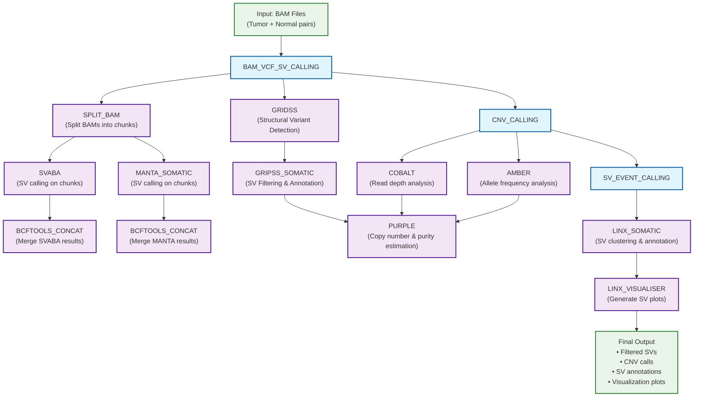

# SowpatiLab/variantscope

## Introduction

**SowpatiLab/variantscope** is a comprehensive bioinformatics pipeline for somatic variant analysis in cancer genomics. The pipeline performs structural variant (SV) calling, copy number variant (CNV) detection, and SV event annotation from tumor-normal paired BAM files.

### Pipeline Overview

The variantscope pipeline integrates multiple state-of-the-art tools to provide a complete somatic variant calling solution:

**Key Features:**
- **Structural Variant Detection**: Uses GRIDSS, MANTA, and SVABA for comprehensive SV calling
- **Copy Number Analysis**: Employs AMBER, COBALT, and PURPLE for accurate CNV detection and tumor purity estimation
- **SV Event Annotation**: Leverages LINX for clustering, annotation, and visualization of structural variants
- **Parallel Processing**: Splits BAM files into chunks for efficient processing of large datasets
- **Quality Control**: Includes GRIPSS for SV filtering and quality assessment

### Workflow Diagram



### Pipeline Components

#### 1. BAM_VCF_SV_CALLING
- **GRIDSS**: Detects structural variants from paired-end and split-read alignments
- **GRIPSS**: Filters and annotates GRIDSS calls for somatic variants
- **SPLIT_BAM**: Divides BAM files into chunks for parallel processing
- **SVABA**: Performs SV calling on chunked BAM files using assembly-based methods
- **MANTA**: Detects structural variants using paired-end and split-read evidence

#### 2. CNV_CALLING
- **AMBER**: Determines allele frequencies at heterozygous sites
- **COBALT**: Calculates read depth ratios across the genome
- **PURPLE**: Estimates tumor purity, ploidy, and copy number segments

#### 3. SV_EVENT_CALLING
- **LINX**: Clusters and annotates structural variants to identify complex events
- **LINX_VISUALISER**: Generates comprehensive visualization plots for SV events

## Usage

> [!NOTE]
> If you are new to Nextflow and nf-core, please refer to [this page](https://nf-co.re/docs/usage/installation) on how to set-up Nextflow. Make sure to [test your setup](https://nf-co.re/docs/usage/introduction#how-to-run-a-pipeline) with `-profile test` before running the workflow on actual data.

### Input Requirements

The pipeline requires tumor-normal paired BAM files and associated reference data.

**Required Reference Files:**
- Reference genome (FASTA) with index and dictionary
- dbSNP VCF file
- AMBER germline sites
- GC profile
- Ensembl gene annotations
- BWA index
- Known fusion genes
- Driver genes list

First, prepare a samplesheet with your input data that looks as follows:

`samplesheet.csv`:

```csv
subject_id,sample_id,sample_type,sequence_type,filetype,filepath,indexpath
subject_a,subject_a_tumor,tumor,dna,bam,assets/test-data/subject_a_tumor.dna.bwa-mem2_2.2.1.markdups.bam,assets/test-data/subject_a_tumor.dna.bwa-mem2_2.2.1.markdups.bam.bai
subject_a,subject_a_normal,normal,dna,bam,assets/test-data/subject_a_normal.dna.bwa-mem2_2.2.1.markdups.bam,assets/test-data/subject_a_normal.dna.bwa-mem2_2.2.1.markdups.bam.bai
```

Each row represents either a tumor or normal sample for a subject, with details about the sample type, sequence type, file type, and paths to the sequence and index files.

### Running the Pipeline

Now, you can run the pipeline using:

```bash
nextflow run SowpatiLab/variantscope \
   -profile <docker/singularity/.../institute> \
   --input samplesheet.csv \
   --outdir <OUTDIR>
```

> [!WARNING]
> Please provide pipeline parameters via the CLI or Nextflow `-params-file` option. Custom config files including those provided by the `-c` Nextflow option can be used to provide any configuration _**except for parameters**_; see [docs](https://nf-co.re/docs/usage/getting_started/configuration#custom-configuration-files).

### Output

The pipeline generates comprehensive output including:

- **Structural Variants**: Filtered and annotated SV calls in VCF format
- **Copy Number Variants**: CNV segments with purity and ploidy estimates
- **SV Annotations**: Clustered SV events with functional annotations
- **Visualizations**: Plots showing SV patterns and genomic rearrangements
- **Quality Metrics**: Summary statistics and quality control reports

For detailed output descriptions, see [output documentation](docs/output.md).

## Credits

SowpatiLab/variantscope was originally written by Isha Choubey, Usman Rashid, Sateesh Peri and vincodesbio.

We thank the following people for their extensive assistance in the development of this pipeline:

- Divya Tej Sowpati, CCMB, Hyderabad, India
- Mainak Chakraborty, Senior Solutions Architect, AWS

## Contributions and Support

If you would like to contribute to this pipeline, please see the [contributing guidelines](.github/CONTRIBUTING.md).

## Citations

An extensive list of references for the tools used by the pipeline can be found in the [`CITATIONS.md`](CITATIONS.md) file.

This pipeline uses code and infrastructure developed and maintained by the [nf-core](https://nf-co.re) community, reused here under the [MIT license](https://github.com/nf-core/tools/blob/main/LICENSE).

> **The nf-core framework for community-curated bioinformatics pipelines.**
>
> Philip Ewels, Alexander Peltzer, Sven Fillinger, Harshil Patel, Johannes Alneberg, Andreas Wilm, Maxime Ulysse Garcia, Paolo Di Tommaso & Sven Nahnsen.
>
> _Nat Biotechnol._ 2020 Feb 13. doi: [10.1038/s41587-020-0439-x](https://dx.doi.org/10.1038/s41587-020-0439-x).
